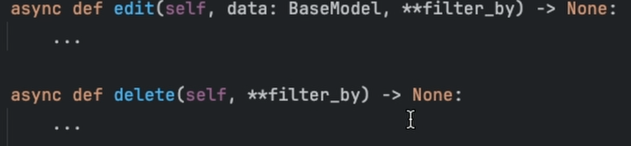
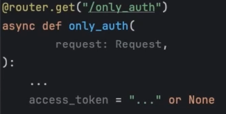
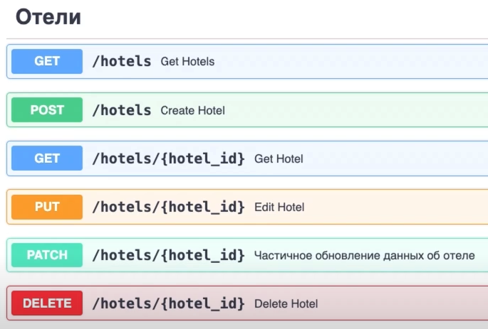

При изучении FastAPI разрабатывается приложение для отелей. Каждое задание складывается в отдельную папку, а не оформляется коммитами - с точки зрения разработки это не совсем правильно (надо делать коммиты), но мне так удобнее.
<br><br>

## Уведомление
1. Код учебный, то есть, содержит все комментарии, которые я пишу сам для себя. Комментариев для стороннего человека может быть много.
2. Итоговый проект будет очищен от всех сторонних комментариев и "лишнего", то есть, учебного, кода. Ссылка будет тут, когда проект доведу до итогового кода.
3. Перед запуском проекта требуется установить пакеты, указанные в файле "requirements.txt", расположенного в соответствующей папке.
4. Начиная с "Задания №3: Миграция для номеров" (папка "[03-PostgreSQL-SQLAlchemy-Models_and_Migrations](03-PostgreSQL-SQLAlchemy-Models_and_Migrations)") требуется создать в корне проекта файл ".env" и заполнить значения, указанные в файле ".env":

```
DB_HOST=
DB_PORT=
DB_USER=
DB_PASS=
DB_NAME=
```

5. Начиная с "Задания №9: "Получение cookie пользователя внутри ручки" (папка "[10-User_authorization_and_authentication-Receiving_user_cookies](10-User_authorization_and_authentication-Receiving_user_cookies)") требуется создать в корне проекта файл ".env" и заполнить значения, указанные в файле ".env":

```
DB_HOST=
DB_PORT=
DB_USER=
DB_PASS=
DB_NAME=

JWT_SECRET_KEY=
JWT_ALGORITHM=
ACCESS_TOKEN_EXPIRE_MINUTES=
```


## Задание №1: PUT и PATCH ручки отелей
Подробное описание в файле "[01-FirstLaunchOfFastAPI/readme.md](01-FirstLaunchOfFastAPI/readme.md)"

Необходимо реализовать 2 ручки:
- Ручка PUT на изменение отеля
- Ручка PATCH на изменения отеля

Код размещён в папке "[01-FirstLaunchOfFastAPI](01-FirstLaunchOfFastAPI)"


## Задание №2: Пагинация для отелей
Необходимо реализовать пагинацию для отелей.

Для этого необходимо добавить 2 query параметра page и per_page, оба параметра являются необязательными. Если пользователь не передает page, то используется значение по умолчанию 1 (то есть первая страница). Для per_page ситуация аналогичная — если параметр не передается, то используется значение по умолчанию 3 (можете выбрать любое другое). 


Структура папок:
- Выполненное задание.
    - Папка "[02-HotelsPagination/02_1-HotelsPagination](02-HotelsPagination/02_1-HotelsPagination)".
    - Подробное описание в файле "[02-HotelsPagination/02_1-HotelsPagination/readme.md](02-HotelsPagination/02_1-HotelsPagination/readme.md)".
- Добавлены зависимости для настройки пагинации (сделано на основании предложенного решения в лекции).
    - Папка "[02-HotelsPagination/02_2-HotelsDependencies](02-HotelsPagination/02_2-HotelsDependencies)".
    - Подробное описание в файле "[02-HotelsPagination/02_2-HotelsDependencies/readme.md](02-HotelsPagination/02_2-HotelsDependencies/readme.md)".
    - Добавлен файл "[dependencies.py](02-HotelsPagination/02_2-HotelsDependencies/dependencies.py)".


Код моего решения размещён в папке "[02-HotelsPagination/02_1-HotelsPagination](02-HotelsPagination/02_1-HotelsPagination)".


## Задание №3: Миграция для номеров

*Внимание!!!*

- Ссылка на гитхаб, заявленная в ответе для задания №3 "Миграция для номеров":
`03-PostgreSQL-SQLAlchemy/Models_and_Migrations`.

- Потом проект из папки `03-PostgreSQL-SQLAlchemy/Models_and_Migrations` был перенесён в папку `03-PostgreSQL-SQLAlchemy-Models_and_Migrations`.


Необходимо создать миграцию (в Alembic они называются ревизии/revisions) 
через терминал ровно так же, как мы делали это в уроке.
Внутри миграции должны появиться изменения: добавление новой таблицы rooms.
После создания миграцию необходимо прогнать (запустить/применить), чтобы 
в базе данных появилась таблица rooms.


Подробное описание в файле "[03-PostgreSQL-SQLAlchemy-Models_and_Migrations/readme.md](03-PostgreSQL-SQLAlchemy-Models_and_Migrations/readme.md)"

Код размещён в папке "[03-PostgreSQL-SQLAlchemy-Models_and_Migrations](03-PostgreSQL-SQLAlchemy-Models_and_Migrations)"


## Задание №4: Фильтрация по подстроке
Необходимо изменить запрос на выборку отелей таким образом, чтобы
1. Поиск не производился по полю id (необходимо убрать id из query параметров).
2. Поиск производился по полям location и title. Причем оба поля необязательны.
3. Поиск по полям location и title должен осуществляться не по полному совпадению, 
а по вхождению вводимого пользователем значения в соответствующие столбцы таблицы.


Подробное описание в файле "[04-PostgreSQL-SQLAlchemy-Filtering_by_substring/readme.md](04-PostgreSQL-SQLAlchemy-Filtering_by_substring/readme.md)"

Код размещён в папке "[04-PostgreSQL-SQLAlchemy-Filtering_by_substring](04-PostgreSQL-SQLAlchemy-Filtering_by_substring)"


## Задание №5: Вставка данных через репозиторий
Необходимо добавить в BaseRepository метод add, который будет
- принимать данные для вставки
- отдавать записанные в базу данных данные в формате модели SQLAlchemy

Внутри ручки POST /hotels необходимо вернуть
```
{"status": "OK", "data": hotel}
```
где hotel — модель Алхимии, которую вернул репозиторий.


Подробное описание в файле "[05-PostgreSQL-SQLAlchemy-Repository-Inserting_data/readme.md](05-PostgreSQL-SQLAlchemy-Repository-Inserting_data/readme.md)"

Код размещён в папке "[05-PostgreSQL-SQLAlchemy-Repository-Inserting_data](05-PostgreSQL-SQLAlchemy-Repository-Inserting_data)"


## Задание №6: Обновление и удаление данных через репозиторий

Необходимо создать 2 метода внутри BaseRepository по заданным сигнатурам (см. [скриншот](06-PostgreSQL-SQLAlchemy-Repository-Updating_Deleting_data/Screenshot_at_Aug_28_23-35-20.png)), а также переписать ручки PUT и DELETE.

***Скриншот:***<br>


Не нужно переписывать PATCH ручку!

- Метод edit изменяет объект(ы) в базе данных. Для обновления объекта нужно принимать его id через параметры пути: PUT /hotels/{hotel_id}

- Метод delete удаляет объект(ы) в базе данных. Для удаления объекта нужно принимать его id через параметры пути: DELETE /hotels/{hotel_id}


*Задание со звездочкой (не рассматривается в решении): перед обновлением или удалением необходимо убедиться, что мы изменяем или удаляем именно один объект. То есть нам не подходят варианты, когда такого объекта нет или объектов с такими фильтрами больше одного. В таких случаях нужно выбрасывать ошибку:

- со статусом 404 в случае, если объект не найден;
- 400 или 422, если объектов больше одного.

*Код со [скриншота](06-PostgreSQL-SQLAlchemy-Repository-Updating_Deleting_data/Screenshot_at_Aug_28_23-35-20.png):*
```
async def edit(self, data: BaseModel, **filter_by) -> None:
    ...

async def delete(self, **filter_by) -> None:
    ...
```


Подробное описание в файле "[06-PostgreSQL-SQLAlchemy-Repository-Updating_Deleting_data/readme.md](06-PostgreSQL-SQLAlchemy-Repository-Updating_Deleting_data/readme.md)"


Код размещён в папке "[06-PostgreSQL-SQLAlchemy-Repository-Updating_Deleting_data](06-PostgreSQL-SQLAlchemy-Repository-Updating_Deleting_data)"


## Задание №7: Ручка на получение отеля

Необходимо создать ручку для получения конкретного отеля `GET /hotels/{hotel_id}`, которая будет вызывать соответствующий метод репозитория и отдавать в ответе данные отеля.


Подробное описание в файле "[07-PostgreSQL-SQLAlchemy-Repository-Getting_data/readme.md](07-PostgreSQL-SQLAlchemy-Repository-Getting_data/readme.md)"

Код размещён в папке "[07-PostgreSQL-SQLAlchemy-Repository-Getting_data](07-PostgreSQL-SQLAlchemy-Repository-Getting_data)"


## Применение паттерна DataMapper
Подробное описание в файле "[08-PostgreSQL-SQLAlchemy-Repository-DataMapper/readme.md](08-PostgreSQL-SQLAlchemy-Repository-DataMapper/readme.md)"


Код размещён в папке "[08-PostgreSQL-SQLAlchemy-Repository-DataMapper](08-PostgreSQL-SQLAlchemy-Repository-DataMapper)"


## Задание №8: Запретить создание нескольких юзеров с одинаковой почтой
Необходимо запретить регистрацию пользователей с одинаковой почтой.

Например, если в базе данных уже есть пользователь с почтой kot@pes.ru, 
то второго пользователя с такой же почтой мы создать не можем.

Подумайте, как можно реализовать это на уровне модели/таблицы/базы данных, 
чтобы не пришлось дописывать дополнительную бизнес-логику внутри ручки 
или репозитория.

Подробное описание в файле "[09-User_authorization_and_authentication-User_registration/readme.md](09-User_authorization_and_authentication-User_registration/readme.md)"


Код размещён в папке "[09-User_authorization_and_authentication-User_registration](09-User_authorization_and_authentication-User_registration)"


## Задание №9: Получение cookie пользователя внутри ручки

Необходимо реализовать получение токена access_token из cookie пользователя, которые отправляет браузер. Внутри cookie может либо находится наш токен, либо будет пусто (если юзер не аутентифицирован).

Цель задания — открыть для себя мир исходного кода библиотек, с которыми вы работаете. Взглянуть на код, который пишут продвинутые Python разработчики (см. [скриншот](10-User_authorization_and_authentication-Receiving_user_cookies/Screenshot_at_Aug_28_23-55-56.png)), а также переписать ручки PUT и DELETE.

***Скриншот:***<br>



*Код со [скриншота](10-User_authorization_and_authentication-Receiving_user_cookies/Screenshot_at_Aug_28_23-55-56.png):*
```
@router.get("/only_auth")
async def only_auth(
        request: Request,
):
    ...
    access_token = "..." or None
```

Подробное описание в файле "[10-User_authorization_and_authentication-Receiving_user_cookies/readme.md](10-User_authorization_and_authentication-Receiving_user_cookies/readme.md)"


Код размещён в папке "[10-User_authorization_and_authentication-Receiving_user_cookies](10-User_authorization_and_authentication-Receiving_user_cookies)"


## Задание №10: Ручка на выход из системы

Необходимо реализовать ручку для выхода из системы. Ручку 
можно назвать /logout. После вызова ручки пользователя должно 
"разлогинить" — подумайте, как это можно реализовать, зная, 
как "залогинить" пользователя

Вам необходимо провести небольшое исследование и понять, 
какой HTTP метод стоит использовать для этой операции — GET, 
POST, PUT, PATCH или DELETE.

Подробное описание в файле "[11-User_authorization_and_authentication-Getting_user_and_Logging_out/readme.md](11-User_authorization_and_authentication-Getting_user_and_Logging_out/readme.md)"


Код размещён в папке "[11-User_authorization_and_authentication-Getting_user_and_Logging_out](11-User_authorization_and_authentication-Getting_user_and_Logging_out)"


## Задание №11: Функционал номеров
Необходимо создать API ручки для взаимодействия с номерами. По сути, 
нужны все те же самые ручки, что мы делали для отелей (см. [скриншот](12-Database-Rooms_functionality/Screenshot_at_Aug_29_01-19-03.png)).

Для этого нужны создать:
- роутер и ручки
- pydantic схемы
- репозиторий

Давайте вынесем роутер с номерами в отдельный файл, чтобы 
файл hotels.py не сильно распух :)

Конкретизировано в видео:
- Именование URL: /hotels/{hotel_id}/rooms/{rooms_id}
- Необходимо реализовать для номеров:
    1. Вывести информацию по всем номерам отеля
    2. Выбрать инфо по конкретному номеру по id
    3. Добавить номер с примерами данных
    4. Изменять номер post
    5. Изменять номер patch
    6. Удалять номер


***Скриншот:***<br>



*Код со [скриншота](12-Database-Rooms_functionality/Screenshot_at_Aug_29_01-19-03.png):*
```
get("/hotels") - Get Hotels
post("/hotels") - Create Hotels
get("/hotels/{hotel_id}") - Get Hotel
put("/hotels/{hotel_id}") - Edit Hotel
patch("/hotels/{hotel_id}") - Частичное обновление данных об отеле
delete("/hotels/{hotel_id}") - Delete Hotel
```

Подробное описание в файле "[12-Database-Rooms_functionality/readme.md](12-Database-Rooms_functionality/readme.md)"


Код размещён в папке "[12-Database-Rooms_functionality](12-Database-Rooms_functionality)"


## Задание № 12: Ручка для добавления бронирования
Необходимо создать API ручку POST /bookings для добавления бронирования.

Принимаемые данные:
- date_from — дата заезда (только дата, без времени)
- date_to — дата выезда (только дата, без времени)
- room_id — id номера


Перед добавлением бронирования необходимо взять актуальную цену 
номера из таблицы rooms (поле price).

Напомню, что это задание предполагает создание новых:
- роутера и ручки
- pydantic схем
- репозитория
    
Конкретизировано в видео:

Не принимаем цену, потому что будем считать её на 
бэкэнде (получаем на уровне базы данных).
Не принимаем user_id, потому что будем получать его из 
авторизационных данных, из токена из куки.

И затем уже перегонять данные в другую pydantic-схему.


Подробное описание в файле "[13-Database-Rooms_functionality-Adding_booking_room/readme.md](13-Database-Rooms_functionality-Adding_booking_room/readme.md)"


Код размещён в папке "[13-Database-Rooms_functionality-Adding_booking_room](13-Database-Rooms_functionality-Adding_booking_room)"


## Задание № 13: Ручки на получение бронирований
Необходимо создать две ручки на получение бронирований:

- Получение всех бронирований /bookings
- Получение только своих бронирований /bookings/me


Код размещён в папке "[14-Database-Rooms_functionality-Getting_booking_room](14-Database-Rooms_functionality-Getting_booking_room)"


## Задание № 14: Вернуть пагинацию и фильтрацию в получение отелей
Необходимо добавить фильтрацию и пагинацию в метод get_filtered_by_time 
в HotelsRepository и в API ручку /hotels. 

Метод get_all в HotelsRepository необходимо удалить.


Код размещён в папке "[15-Database-Rooms_functionality-Raw_SQL_queries](15-Database-Rooms_functionality-Raw_SQL_queries)"


## Задание № 15: Получение и добавление удобств
Необходимо добавить роутер для удобств и две ручки:

    GET /facilities на получение всех удобств
    POST /facilities для добавления нового удобства

Обратите внимание, что пока мы не используем m2m таблицу. 
Она пригодится нам позже.


Код размещён в папке "[16-Database-Rooms_functionality-Adding_facilities-Many_to_many_relationship](16-Database-Rooms_functionality-Adding_facilities-Many_to_many_relationship)"


## Задание № 16: Изменение удобств номера через API

Необходимо вместе с редактирование номеров через PUT и PATCH дать 
возможность редактировать удобства номера.

То есть новых ручек создавать не нужно — все задание решается 
внутри уже существующих ручек на изменение номера.

Звучит просто. Но на деле всё сложнее. У номера уже могут быть 
какие-то удобства, например, с айдишниками 1 и 2. А пользователь 
решил убрать удобство 1 и добавить удобство 3.

Теперь, нам как бэкендерам, необходимо удалить из m2m таблицы 
удобство 1 и добавить удобство 3. В идеале оставить удобство 2 
нетронутым, чтобы:

1. Запросы происходили быстрее (т.к. часть данных не изменяется).
2. Столбец id не рос слишком быстро. А то может случиться так, 
   что он превысит лимит и нам придется тратить память, чтобы 
   увеличить лимит столбца id (речь про тип bigint в PostgreSQL).


Задача в том, чтобы придумать рабочий способ определения тех удобств, 
которые нуждаются в удалении или добавлении. И произвести манипуляции 
вставки или удаления только с ними. А нетронутые удобства оставить 
нетронутыми.


Код размещён в папке "[17-Database-Rooms_functionality-Changing_rooms_facilities](17-Database-Rooms_functionality-Changing_rooms_facilities)"


## Задание № 17: Получение удобств конкретного номера

Необходимо получать удобства в ручке для получения конкретного номера.

Для этого необходимо создать новый метод в репозитории RoomsRepository, 
который подгрузит удобства через relationship, и вызвать этот метод внутри ручки.


Код размещён в папке "[18-Database-Rooms_functionality-Relationship](18-Database-Rooms_functionality-Relationship)"


